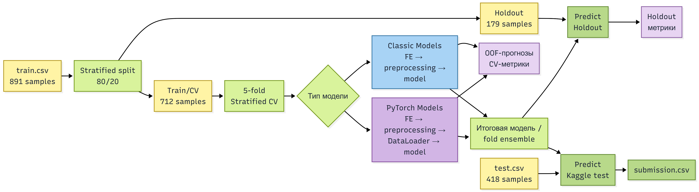
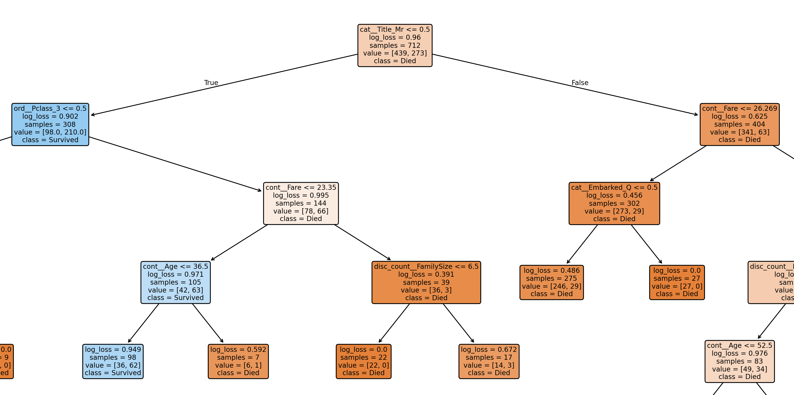
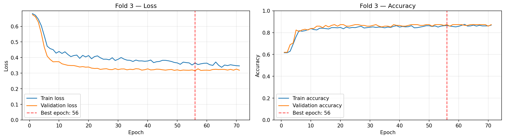

# Предсказание выживаемости пассажиров Titanic

Учебный проект по построению воспроизводимого end-to-end pipeline для задачи бинарной классификации из соревнования [Titanic — Machine Learning from Disaster](https://www.kaggle.com/competitions/titanic).

Главная цель проекта - не только получить высокую Accuracy, но и последовательно пройти полный цикл разработки ML-решения: исследование данных, построение валидации, Preprocessing, Feature Engineering, сравнение моделей, подбор гиперпараметров, анализ ошибок, логирование и др.

В ходе проекта проведено более 300 экспериментов и реализовано девять подходов: Rule-Based baseline, Logistic Regression, KNN, Decision Tree, Random Forest, CatBoost, LightGBM, XGBoost и DNN.

Основной локальной метрикой выбрана Accuracy на 5-fold Stratified Cross-Validation. Дополнительно рассчитываются Precision, Recall, F1, ROC-AUC, PR-AUC, Logloss, Brier score и Confusion Matrix. Качество также проверяется на отдельной holdout-выборке и Kaggle Public Leaderboard.

### Ключевые результаты

- Лучший CV: **XGBoost - 0.8638 ± 0.0269**.
- Лучший Holdout: **LightGBM и DNN - 0.8659**.
- Лучший Kaggle LB: **CatBoost - 0.79186**.
- Финальная DNN: **26 → 64 → 32 → 16 → 1**, Adam, `lr=0.001`.


## 1. Быстрый запуск

```bash
git clone https://github.com/AntonUkhabin/Kaggle-Titanic.git
cd Kaggle-Titanic

conda create -n final_project python=3.14
conda activate final_project
python -m pip install -r requirements.txt

python main.py
```

Датасет уже находится в каталоге `data`.

Перед запуском в `config.py` необходимо задать уникальное `experiment_name` и выбрать `model.active`.

Доступные модели: `logistic_regression`, `knn`, `decision_tree`, `random_forest`, `catboost`, `lightgbm`, `xgboost`, `dnn`.

`main.py` запускает полный pipeline: Cross-Validation, обучение, оценку на holdout и создание `outputs/submission.csv`. Логи, OOF-прогнозы, ошибки моделей, графики и checkpoints сохраняются в каталоге `outputs`.

## 2. Общий pipeline

После загрузки и разделения данных выполнение разделяется на два направления: sklearn pipeline для классических моделей и PyTorch training pipeline для нейросети.



Для классических алгоритмов Feature Engineering, Preprocessing и модель объединены в sklearn `Pipeline`. 

Для DNN используется отдельный PyTorch pipeline с преобразованием данных в тензоры, `DataLoader`, собственным циклом обучения, early stopping и сохранением checkpoints.

Все преобразования обучаются отдельно внутри каждого fold только на его тренировочной части. Валидационная часть обрабатывается уже обученными трансформерами, что предотвращает утечку данных.

Holdout-выборка не участвует в кросс-валидации и подборе модели, а используется для дополнительной локальной проверки. В зависимости от настроек итоговый прогноз строится одной моделью или усреднением вероятностей fold ensemble.

## 3. Feature Engineering

В ходе экспериментов из исходных столбцов были получены следующие признаки:


| Признак      | Источник         | Описание                                            |
| ------------ | ---------------- | --------------------------------------------------- |
| `Title`      | `Name`           | Обращение пассажира: Mr, Mrs, Miss, Master или Other|
| `Age`        | `Age`, `Title`   | Пропуски заполняются медианным возрастом по `Title` |
| `FamilySize` | `SibSp`, `Parch` | Размер семьи: `SibSp + Parch + 1`                   |
| `IsAlone`    | `FamilySize`     | Признак пассажира, путешествующего без семьи        |
| `CabinKnown` | `Cabin`          | Указана ли каюта                                    |
| `Deck`       | `Cabin`          | Палуба, извлечённая из номера каюты                 |


В финальный набор вошли:

```text
Age, Fare, FamilySize, IsAlone, CabinKnown,
Pclass, Sex, Title, Deck, Embarked
```

Служебные и текстовые столбцы `PassengerId`, `Name`, `Ticket`, `Cabin`, `SibSp` и `Parch` не передаются модели напрямую после извлечения полезной информации.

Не все идеи дали устойчивое улучшение. В финальный pipeline не вошли `FarePerPerson`, `TicketPrefix`, `SharedTicketCount`, отдельное использование `SibSp`, а также более сложные преобразования `Age` и `Fare`.

Один из интересных результатов экспериментов:

> Для Decision Tree признак `Title` практически полностью заменяет `Sex`, тогда как `Sex` не способен заменить `Title`. *Подробнее в разделе Модели и эксперименты, Деревья, Decision Tree.*

Более подробный анализ распределений, пропусков и взаимосвязей между признаками находится в `EDA.ipynb`.

## 4. Модели и эксперименты

Эксперименты проводились последовательно: от простого rule-based baseline к линейным моделям, деревьям, градиентным бустингам и нейронной сети. Основной набор признаков сохранялся общим, а preprocessing адаптировался под особенности отдельных групп моделей.

### Базовые модели

В качестве отправной точки использовалось простое правило, основанное на поле пассажира. Затем были обучены `Logistic Regression` и `KNN`.

`Logistic Regression` показала заметный прирост после добавления Feature Engineering. Лучший результат получен с ElasticNet-регуляризацией при `l1_ratio=0.5` и `C=0.7`.

Для `KNN` отдельно подбирались количество соседей, способ взвешивания, метрика расстояния и набор признаков. Лучший результат модель показала без `Embarked` и `IsAlone`, тогда как для остальных моделей полный набор базовых признаков оказался предпочтительнее.

### Деревья

Для `Decision Tree` проверялись глубина, критерий разбиения, ограничения на листья и предварительная обрезка дерева. Критерий `gini` оказался лучше `entropy` и `log_loss`.

Интересным результатом стало взаимодействие признаков `Title` и `Sex`: для Decision Tree признак `Title` практически полностью заменял `Sex`, но обратная замена приводила к ухудшению качества.



[Открыть полную визуализацию Decision Tree](./assets/136_decision_tree_optuna_final.png)

`Random Forest` заметно превзошёл отдельное дерево и стал первым подходом с CV Accuracy выше `0.84`. Наибольший вклад дали ограничения сложности деревьев и минимального количества объектов в листьях.

### Градиентный бустинг

Были реализованы `CatBoost`, `LightGBM` и `XGBoost`. Для каждого алгоритма сначала проводился последовательный ручной подбор параметров, после чего использовалась `Optuna`.

При ручном подборе и оптимизации с Optuna сильные результаты обычно получались при относительно высоком `learning_rate`. Дополнительно проверялась противоположная стратегия: меньший `learning_rate`, большое количество деревьев и увеличенный `early_stopping_rounds`. Она требовала значительно больше времени, но не дала устойчивого улучшения.

`CatBoost` показал наиболее стабильные результаты среди сильных моделей. Эксперимент `177_catboost_learning_rate_0_05` получил лучший результат проекта на Kaggle Public Leaderboard — `0.79186`, хотя уступал другим конфигурациям по локальной CV Accuracy.

Для `LightGBM` ручной подбор параметров оказался успешнее оптимизации с `Optuna`. Лучшее качество было получено при небольшой сложности отдельных деревьев.

`XGBoost` показал максимальную CV Accuracy проекта — `0.8638`. Оптимальной оказалась неглубокая модель с `max_depth=2`, однако преимущество на Cross-Validation не подтвердилось на holdout и Kaggle LB.

### Нейронная сеть

Для табличных данных была реализована отдельная `DNN` на PyTorch. В ходе экспериментов изменялись количество скрытых слоёв, их ширина, `dropout`, оптимизатор и `learning_rate`. Лучшей оказалась архитектура `26 → 64 → 32 → 16 → 1` с оптимизатором Adam и `learning_rate=0.001`.

Также проверялись `CosineAnnealingLR` и `ReduceLROnPlateau`. Планировщики скорости обучения либо не изменяли качество, либо приводили к небольшому ухудшению, поэтому в финальную конфигурацию они не вошли.

Модель обучалась с `BCEWithLogitsLoss`. Для каждого fold применялись early stopping и сохранение лучшего checkpoint, а итоговый прогноз формировался усреднением вероятностей пяти fold-моделей.

DNN не превзошла градиентные бустинги по Cross-Validation, но разделила с LightGBM лучший результат на holdout - `0.8659`. Для каждого fold сохранялись графики train/validation loss и Accuracy, позволяющие контролировать динамику обучения и возможное переобучение.



[Открыть полную визуализацию DNN](./assets/309_dnn_64_32_16_lr_0_001.png)

## 5. Итоговые результаты

В таблице приведены лучшие локальные конфигурации каждого подхода. Основным критерием выбора служила средняя Accuracy на Cross-Validation. Holdout и Kaggle LB использовались как дополнительные проверки. 


| Model               | Experiment | CV Accuracy | CV STD     | Holdout    | Kaggle LB   |
| ------------------- | ---------- | ----------- | ---------- | ---------- | ----------- |
| Rule-Based          | 2          | 0.7879      | 0.0200     | 0.8212     | 0.76315     |
| Logistic Regression | 48         | 0.8357      | 0.0197     | 0.8380     | 0.77033     |
| KNN                 | 82         | 0.8357      | 0.0253     | 0.8324     | 0.77033     |
| Decision Tree       | 136        | 0.8286      | 0.0191     | 0.8547     | 0.76555     |
| Random Forest       | 164        | 0.8441      | 0.0225     | 0.8547     | 0.77272     |
| CatBoost - best CV  | 218        | 0.8553      | 0.0188     | 0.8436     | 0.77751     |
| CatBoost - best LB  | 177        | 0.8385      | **0.0151** | 0.8380     | **0.79186** |
| LightGBM            | 234        | 0.8567      | 0.0202     | **0.8659** | 0.76076     |
| XGBoost             | 293        | **0.8638**  | 0.0269     | 0.8380     | 0.76076     |
| DNN                 | 309        | 0.8371      | 0.0257     | **0.8659** | 0.77272     |


Лучший локальный результат показал XGBoost, однако он не подтвердился на holdout и Kaggle Public Leaderboard. Самым стабильным среди сильных решений оказался CatBoost, а лучший результат на holdout получили LightGBM и DNN.

Отдельно сохранён эксперимент `177_catboost_learning_rate_0_05`: при более низком CV он показал лучший результат проекта на Kaggle — `0.79186`.

## 6. Структура проекта и выходные артефакты

```text
Titanic_kaggle/
├── assets/                    # Изображения для README
├── data/
│   ├── train.csv
│   └── test.csv
├── outputs/
│   ├── checkpoints/           # Сохраненные модели DNN
│   ├── logs/                  # Сохранение вывода терминала
│   ├── oof/                   # OOF-прогнозы и ошибки
│   ├── optuna/                # Результаты Optuna
│   ├── torch_plots/           # Визуализация обучения DNN
│   ├── tree_plots/            # Визуализации деревьев
│   └── submission.csv
├── src/
│   ├── data.py                
│   ├── experiment_logging.py  # Логирование метрик и артефактов
│   ├── feature_engineering.py # Пользовательские sklearn-трансформеры
│   ├── optuna_tuning.py       # Оптимизация гиперпараметров с помощью Optuna
│   ├── preprocessing.py       # Preprocessing для разных моделей
│   ├── torch_models.py        # Архитектура DNN
│   ├── torch_training.py      # Обучение и валидация DNN
│   ├── train_functions.py     # Обучение и CV классических моделей
│   └── utils.py               
├── config.py                  
├── main.py                    # Запуск основного pipeline
├── main_optuna.py             # Запуск Optuna
├── EDA.ipynb                  # Исследовательский анализ данных
├── draft.ipynb                # Рабочие эксперименты
├── requirements.txt
└── README.md
```

Каждому эксперименту присваивается номер и информативное имя. Подробные отчёты — в `outputs/logs/`. Дополнительно сохраняются OOF-прогнозы, ошибки классификации, результаты Optuna, checkpoints и графики обучения.

В отличие от production-репозитория, каталоги `data` и `outputs` намеренно сохранены в Git. Это позволяет запустить учебный проект без отдельной подготовки данных и проследить историю экспериментов по логам, OOF-прогнозам, визуализациям и итоговым submissions.

Автоматически создаваемый каталог `outputs/snapshots/` исключён через `.gitignore`.

## 7. Основные выводы

- Наиболее заметный прирост дал Feature Engineering.
- Единого лидера не получилось: XGBoost показал лучший CV, LightGBM и DNN лучший holdout, CatBoost лучший Kaggle LB.
- Высокий CV не всегда подтверждался на holdout и Kaggle.
- Optuna не всегда превосходила ручной подбор параметров.
- DNN показала конкурентный результат, но не превзошла бустинги по CV.


## 8. Ограничения

- Небольшой размер датасета увеличивает зависимость результатов от разбиения.
- Более 300 экспериментов на фиксированных folds могли привести к частичной адаптации под Cross-Validation.
- Accuracy и Kaggle Public Leaderboard не дают полной оценки качества модели.


## 9. Нереализованные идеи

- `AgeBins`, `FareBins` и `FamilySizeBins`;
- взаимодействия `FamilySize × Pclass` и `Age × Sex`;
- blending или stacking моделей;
- анализ признаков с помощью SHAP;
- CNN для табличных данных;
- оптимизация типов данных для уменьшения потребления памяти;
- оценить влияние на DNN признаков, оказавшихся неэффективными для классических моделей.

